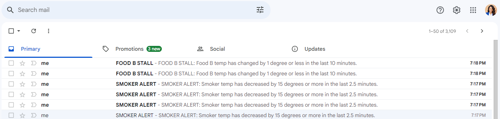

# streaming-05-smart-smoker
Repository for Streaming Project 5: Creating a Producer

# Topaz Montague

# Project Repository: [Project  - Creating a Producer-Smart Smoker](https://github.com/tfmontague/streaming-05-smart-smoker)

## Project Overview

> This project is to design and implement a Smart Smoker program that monitors the temperature of a smoker and food.

The Smart Smoker program processes a CSV file to set up a producer with three task queues. It simulates continuous temperature readings from a smart smoker and two food items, capturing temperatures every 30 seconds.

The smoker-temp.csv file includes four columns: [0] Date-time stamp, [1] Smoker temperature, [2] Food A temperature, and [3] Food B temperature.

| Date-time stamp | Smoker temperature | Food A temperature | Food B temperature |
|-----------------|--------------------|--------------------|--------------------|

Three consumers are assigned to the producer, each one dedicated to a specific temperature queue.

## Project Approach

Python will be used to:

- Simulate a streaming series of temperature readings from our smart smoker and two foods.
- Create a producer to send these temperature readings to RabbitMQ.
- Create three consumer processes, each one monitoring one of the temperature streams. 
- Perform calculations to determine if a significant event has occurred.

## Program Significant Events & Alerts

The Smart Smoker program is designed to be triggered based on the following events:

- Smoker Alert! Smoker temperature decreases by more than 15 degrees F in 2.5 minutes
- Food Stall! Any food temperature changes less than 1 degree F in 10 minutes

and to signal the following based on the events:

- Alert the user when a significant event occurs
- Send the user an email for each alert

## Prerequisites

- RabbitMQ server running
- Pika installed in the active Python environment
- Configure`.env.toml` with appropriate email configuration settings

```python
outgoing_email_host = "smtp.example.com"
outgoing_email_port = 587
outgoing_email_address = "your_email@example.com"
outgoing_email_password = "your_password"
```

## Running the Program

- Open VS Code Terminal
- Open 3 additional VS Code Terminals using the Split Terminal function
- Run `python bbq-producer.py` in the 1st terminal
- Run `python bbq-consumer-foodA.py` in the 2nd terminal
- Run `python bbq-consumer-foodB.py` in the 3rd terminal
- Run `python bbq-consumer-smoker.py` in the 4th terminal

## Screenshots

- Multiple Concurrent Processes


- Email Alerts



